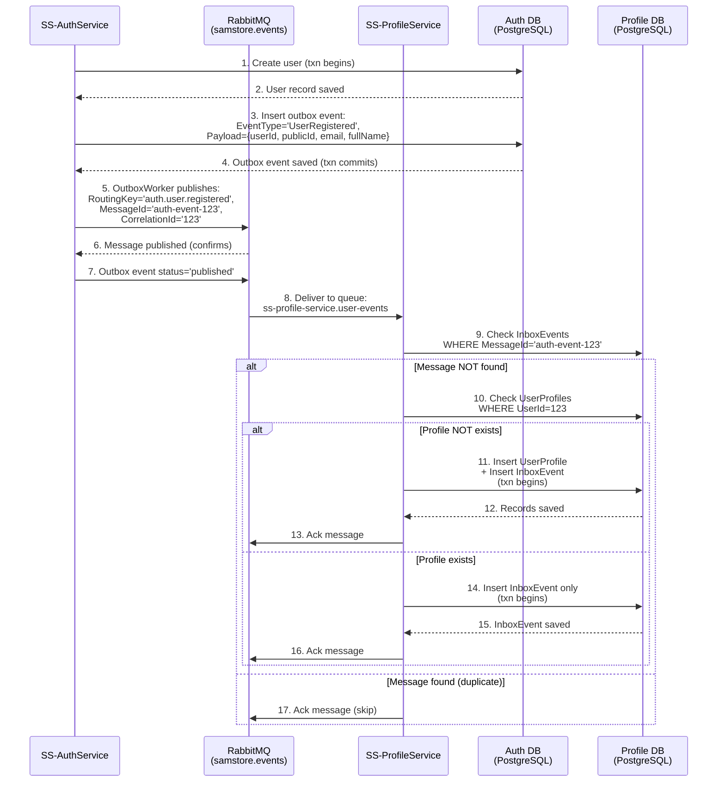

# Integration with SS-ProfileService

## Overview
SS-AuthService is responsible for user authentication and identity management.
SS-ProfileService manages user profile data.

To ensure that a user's profile is ready upon registration and verification, SS-AuthService publishes events that SS-ProfileService consumes to automatically create a base profile.

## Events Published by SS-AuthService

### UserRegistered
- **Routing Key:** `auth.user.registered`
- **Payload:**
  ```json
  {
    "userId": 123,
    "publicId": "guid-here",
    "email": "user@example.com",
    "fullName": "Full Name"
  }
  ```
- **When Published:** After a user successfully registers (before email verification).

### UserVerified
- **Routing Key:** `auth.user.verified`
- **Payload:**
  ```json
  {
    "userId": 123,
    "publicId": "guid-here",
    "email": "user@example.com"
  }
  ```
- **When Published:** After a user verifies their email address.

## Integration Flow



## Infrastructure
- **Message Broker:** RabbitMQ
- **Exchange:** `samstore.events` (Topic exchange)
- **Outbox Pattern:** SS-AuthService uses an outbox table and worker to reliably publish events.

## Recommendations for Consumers (SS-ProfileService)
1. Create a queue bound to the `samstore.events` exchange with routing key `auth.user.registered` (or `auth.user.verified`).
2. Implement a background worker to consume messages from this queue.
3. Use an idempotent inbox pattern (store processed message IDs) to prevent duplicate processing.
4. On receiving a `UserRegistered` or `UserVerified` event, create a UserProfile if one does not already exist.

## Notes
- The payload structure is considered stable for version 1.0.
- Any changes to the event structure should be versioned and backward compatible.